# ROUTING.md — option generation, recommendation and explanation

> Owns: how trip options are generated, measured, filtered, recommended and explained; the provider abstraction and provenance model; the mobile ↔ BFF API contract.
> Does **not** own: data-source availability and constants' sources (DATA.md), screens and copy (DESIGN.md), priorities (PLAN.MD).
> Status (2026-10-10): **CURRENT (v0.1-alpha).** The pipeline, recommendation, explanation and contract below are implemented in `lib/mobility/*` and `app/api/mobility/plan/route.ts`. **Route legs come from `DemoRoutingProvider` (synthetic)** until OpenTripPlanner is connected ([ADR-0002](docs/adr/0002-routing-provider-strategy.md)). Parameters marked *(tunable)* are team assumptions in `lib/mobility/config.ts`.

## 1. Pipeline overview

```mermaid
flowchart LR
  REQ["POST /api/mobility/plan<br/>(origin, destination, arriveBy, stay?, profile)"] --> VAL["validate.ts"]
  VAL --> GEN["plan.ts: strategies in parallel<br/>car · transit · park_and_ride"]
  GEN --> PROV["providers: RoutingProvider (demo → OTP)<br/>JUDU P+R list · JUDU zone lookup"]
  PROV --> MET["metrics.ts: cost, CO₂, basis"]
  MET --> FEAS["lateness + walking limit"]
  FEAS --> REC["recommend.ts: dominance → preference"]
  REC --> EXP["explain.ts: Lithuanian sentence<br/>from metric differences"]
  EXP --> RES["PlanResponse: options, recommendation,<br/>dataMode, sources, assumptions, warnings"]
```



Everything runs **server-side in the BFF**. The mobile app renders the result and does not re-rank. A preference change on the comparison screen sends a new request.

## 2. Strategies

| Strategy id | Legs | Priority | Requires | Status |
|---|---|---|---|---|
| `car` | drive origin → destination, park + walk (one `park` leg) | **P0** | `profile.car.available` | CURRENT |
| `transit` | walk → ride(s), transfer walk → walk | **P0** | origin **and** destination inside the city bbox (JUDU network) | CURRENT |
| `park_and_ride` | drive origin → P+R site, park, then a transit itinerary site → destination | **P0** | `profile.car.available`, ≥ 1 official P+R site on the way | CURRENT |
| `park_and_walk` | drive to a cheaper zone or lot, walk | P1 | zones (CURRENT) + lots layer (DATA.md › A2) | PLANNED |
| `walk`, `bike`, `bikeshare` | — | P1 | — | PLANNED |
| `scooter`, `train`, combinations | — | P2 | — | — |

**Service area** (`validate.ts`, `config.ts`):
- the destination must lie inside the Vilnius bounding box;
- the origin may lie up to **40 km** from Katedros a., because commuters driving in are the core P+R case;
- if the origin is outside the bbox, `transit` is unavailable with a reason.

**P+R composition (`plan.ts`):**
1. Sites come from the **official JUDU list** (DATA.md › A4b).
2. A site is "on the way" when all three hold *(tunable)*:
   - origin → site is shorter than origin → destination;
   - the site is ≥ 2 km from the destination;
   - origin → site → destination ≤ 1.4 × origin → destination (straight lines).
3. Take up to 3 candidates. For each, fix the transit itinerary site → destination by `arriveBy`. Then add a 3-minute park leg before the first transit leg *(tunable)*. Then back-calculate the drive origin → site.
4. Keep **one** P+R option: the best candidate on the preference's metric (time for fastest/balanced, cost, CO₂), with time as the tie-break.
5. No site on the way → no P+R option, and an `unavailable` entry with the reason.

## 3. Arrive-by handling

- **Transit:** the provider plans in arrive-by mode, and its legs carry absolute times. The demo provider arrives 0–4 minutes early (timetable granularity).
- **Car:** arrival = `arriveBy`. The park leg (8 min in a paid zone, 4 otherwise *(tunable)*) precedes it, and the drive precedes that. Driving time is requested for ~30 minutes before arrival, so peak hours apply.
- **P+R:** transit fixed first, then park, then drive (§ 2).
- **Lateness:** if an option would have to depart before *now*, it departs now, arrives late, and carries `feasibility.lateMin`.
- **Timezone:** `Europe/Vilnius`. `arriveBy` is ISO-8601 with an offset, and must be no more than 12 hours in the past and no more than 30 days in the future.

## 4. Metric models and provenance

Constants and their sources: DATA.md › A6 and `lib/mobility/config.ts`.

| Metric | `car` | `transit` | `park_and_ride` |
|---|---|---|---|
| **Time** (min, door to door) | drive + park/walk buffer | first walk start → last walk end (incl. waits, transfers) | drive + park + transit itinerary |
| **Cost** (€) | km × consumption/100 × energy price + **zone parking** for the stay (pro rata in paid hours) | single fare by ride span (30 min 1,00 €, otherwise n × 60 min 1,25 €); **0 € with a pass** | car-leg energy + **P+R ticket 1,00 €** (includes PT for one person; no separate fare) |
| **CO₂** (kg) | litres or kWh × factor by fuel (hybrid uses petrol) | passenger-km × local-bus factor | car part + transit part |
| **Parking** | zone name, cost, paid minutes | — | site name, 1,00 € |

**Basis** (`types.ts › Basis`), weakest first:
- `demo`: synthetic;
- `estimate`: our model or an assumption;
- `official`: published static data;
- `live`: real-time.

A metric's basis is the **weakest** of its inputs (`metrics.ts › weakest`). With demo legs, every metric is `demo`; with OTP legs, the same code yields `official`/`estimate`. The app shows "~" for `demo` and `estimate`.

**`dataMode`** (response level) answers "are the routes real?":
- `demo`: all non-park legs are demo;
- `live`: none are;
- `mixed`: some are.

Notes:
- **Stay duration:** the request's optional `stayMinutes`. Without it, 120 minutes is used and stated (`trip.stayAssumed`, `assumptions[]`).
- **Unknown values are `null`, never 0.** A failed zone lookup gives `costEur: null` plus a warning.
- **Energy price:** `profile.car.fuelPriceEur` if given, otherwise a labelled default (assumption).

## 5. Feasibility and dominance

- No car → `car` and `park_and_ride` are unavailable (`unavailable[]`, code `no_car`).
- **Walking:** total walk minutes > `profile.maxWalkMin` sets `feasibility.overWalk = true`. The option is kept and flagged, not removed.
- **Provider failure** removes only the affected strategy (`warnings[]` + `unavailable[]`). The request fails only on invalid input or an internal error.
- **Dominance** (`recommend.ts › dominates`): an option no worse on time, cost and CO₂ and strictly better on one dominates another. It is checked only within the same feasibility class, and unknown (`null`) values never dominate.
  - Dominated options get `status: "dominated"`, `dominatedBy`, and a summary naming the option that dominates them.
  - They are never recommended.

## 6. Recommendation rules (CURRENT, `recommend.ts`)

1. **Pool:**
   - options that are on time and within the walking limit;
   - otherwise, on-time options;
   - otherwise **all late**: the least-late option, with `state: "all_late"`.
2. Remove dominated options from the pool.
3. Apply the preference (from the profile; the app can override it per request):

| Preference | Rule (`recommendation.rule`) | Tie-break |
|---|---|---|
| `fastest` | `fastest:min_time` — minimum duration | cost, then CO₂ |
| `cheapest` | `cheapest:min_cost` — minimum cost (`null` last) | time |
| `greener` | `greener:min_co2` — minimum CO₂ | time |
| `balanced` | `balanced:tolerance` or `balanced:fastest` — see below | less extra time |

**Balanced** (`config.ts › BALANCED`, *tunable*). This is a tolerance rule, not a hidden score.
- Start from the fastest option F.
- Another option C qualifies when all of these hold:
  - C is at most `max(10 min, 20 % of F)` slower;
  - C is **no more expensive and no dirtier** than F;
  - C saves **≥ 1,50 €** or **≥ 30 % CO₂**.
- Among qualifying options, pick the one with the largest benefit = Δ€ / 1,50 + ΔCO₂% / 30 %.
- If the cost of either is unknown, decide on CO₂ alone.
- If nothing qualifies, recommend F (`balanced:fastest`).

The benefit number is internal and never shown; the user sees the raw differences.

## 7. Explanation generation (CURRENT, `explain.ts`)

Deterministic Lithuanian templates. No LLM. Every number comes from the metrics shown.

1. **Reference:**
   - the car option, when the recommendation is not the car;
   - otherwise the next best option on the preference's metric.
2. **Facts:** signed Δ time, Δ cost and Δ CO₂ % against the reference.
   - Mentioned only from 2 min, 0,50 € or 10 % *(tunable)*.
   - Similar time becomes a trailing clause: "…, o kelionės laikas beveik toks pat".
   - Ordered by preference (cheapest → money first), with at most 3 facts.
3. **Headline:** "Greičiausias variantas" / "Pigiausias variantas" / "Mažiausiai CO₂". It is used **only if that claim holds against all options**.
4. **Parking fact:** if the reference is the car with a paid zone, add "Nereikės mokėti už stovėjimą (Raudona zona, ~22,50 €)."
5. **Feasibility note:** when an option better on the user's priority was excluded, say why:
   - "Kitiems variantams reikėtų eiti pėsčiomis ilgiau, nei nurodėte profilyje.";
   - "Kiti variantai laiku nespėtų."
   It **leads** the sentence when it is the deciding reason (the headline claim does not hold).
6. **Alternatives** get one line relative to the recommendation ("9 min. greičiau, 22,59 € brangiau ir ~62 % daugiau CO₂ nei rekomenduojamas variantas."). Dominated options are described against the option that dominates them.
7. **Structured reasons** come with the sentence (`recommendation.reasons`):
   - `deltaMin > 0` = slower; `deltaEur > 0` = cheaper; `deltaPct > 0` = less CO₂;
   - plus `parking` and `feasibility` codes.
8. Formatting: lt-LT decimals, "€" after the number, "~" for estimates; `format.ts` has the plural helper.

Example (demo legs, real JUDU tariff, `lib/mobility/scenarios/uc1-commute-from-district.json`, `balanced`):
> „Tik 10 min. lėčiau, 22,23 € pigiau ir ~10 % mažiau CO₂ nei važiuojant automobiliu. Nereikės mokėti už stovėjimą (Raudona zona, ~22,50 €).“

## 8. Provider abstraction (CURRENT, `lib/mobility/providers/*`)

```ts
// lib/mobility/providers/types.ts (abridged)
interface RoutingProvider {
  readonly source: SourceRef;
  drive(from: Place, to: Place, at: Date): Promise<StreetPath>;                  // km, min, geometry, basis
  transit(from: Place, to: Place, arriveBy: Date): Promise<TransitItinerary | null>; // legs, ride span, pkm, transfers
}
interface ParkingZoneProvider { readonly source: SourceRef; zoneAt(p: LatLng): Promise<string | null> } // throws on failure
interface ParkingAvailabilityProvider {
  snapshot(): Promise<{ source: SourceRef; bySiteId: Record<string, ParkingInfo["availability"]> }>;
}
type PlanDeps = { routing; parkingZones; parkRide: { source; sites }; parkingAvailability?; now };
```

| Provider | File | Status | Source |
|---|---|---|---|
| Routing: **demo** | `providers/demo.ts` | CURRENT, synthetic, `basis: "demo"` | none |
| Routing: OpenTripPlanner | `providers/otp.ts` | **PLANNED** (ADR-0002) | OTP GraphQL ← JUDU GTFS + OSM |
| P+R sites | `providers/judu-park-ride.ts` | CURRENT (static, official) | judu.lt |
| Paid-zone lookup | `providers/judu-parking-zones.ts` | CURRENT (live, 2,5 s timeout, 24 h cache, failure → `null` cost + warning) | JUDU ArcGIS layer |
| Enricher: P+R occupancy | `providers/judu-parking-occupancy.ts` + `judu-parking-occupancy-data.ts` | CURRENT (3 P+R sites) | JUDU occupancy layer (DATA.md › A4b); fills `parking.availability` |
| Enricher: live transit | — | PLANNED (P1) | stops.lt GTFS-RT (to confirm) or `gps_full.txt` |
| Enricher: weather | — | PLANNED (P1) | Meteo.lt |

Rules:
- **Selection:** `MOBILITY_ROUTING_PROVIDER` (server env; default `demo`; `providers/index.ts`). An unknown value throws, so demo data is **never** served silently in place of a configured real provider.
- **Adding a real provider:** implement `RoutingProvider`, register it in `providers/index.ts`, document the source in DATA.md. `plan.ts`, the rules, the contract and the app do not change. Legs must carry their real `basis` (`official` for timetable, `live` for real-time).
- **Enrichers** must have a time budget and fall back to static data. They report through `sources[]`/`warnings[]`.
- **Occupancy:** fetched once in parallel with eligible P+R routes, attached by canonical site id to the selected option. Optional in injected `PlanDeps`. Timeout 2,5 s, 30 s cache/backoff, observation age ≤2 min (30 s future clock tolerance). Missing/invalid/stale/error → `null` + `parking_availability_unknown`, with static site/ticket/route data retained. It does not rank or reject a site: observations describe now, not the trip's future arrival. Counts, source fetch time and observation time are preserved; demo legs and `dataMode` keep their existing meaning.
- **Demo legs** never carry real line numbers (`line: null`) and are always labelled. Do not tune the demo provider to make a desired option win.

Provider choice and alternatives (JUDU planner API, OTP, Google Routes, Transitous): [ADR-0002](docs/adr/0002-routing-provider-strategy.md).

## 9. API contract (CURRENT, version 1)

**Canonical types: `lib/mobility/types.ts`.** The app imports them type-only (`mobile/src/api/contract.ts`, ADR-0003). Change this section, the types and the app in **one PR**. The existing public endpoints (`/api/accidents`, `/api/reports`, `/api/geocode`, `/api/blackspots`) are unchanged. The app uses `GET /api/geocode` as is.

`POST /api/mobility/plan`

```jsonc
// request
{
  "origin":      { "lat": 54.7356658, "lng": 25.2268215, "label": "Gabijos g. 63, Vilnius" },
  "destination": { "lat": 54.6873532, "lng": 25.2817067, "label": "Gedimino pr. 9, Vilnius" },
  "arriveBy": "2026-10-12T08:45:00+03:00",
  "stayMinutes": 540,                                   // optional (5–1440); default 120, stated
  "profile": {                                          // optional; defaults stated in assumptions
    "car": { "available": true, "fuel": "petrol|diesel|lpg|hybrid|electric", "consumption": 7, "fuelPriceEur": 1.79 }, // price optional
    "transitPass": false,
    "maxWalkMin": 15,
    "preference": "fastest|cheapest|greener|balanced"
  }
}
// response (abridged)
{
  "version": 1, "generatedAt": "…", "dataMode": "demo|live|mixed",
  "trip": { "origin": {}, "destination": {}, "arriveBy": "…", "stayMinutes": 540, "stayAssumed": false },
  "options": [{
    "id": "park_and_ride", "strategy": "park_and_ride", "title": "„Statyk ir važiuok“ (P+R)",
    "departAt": "…", "arriveAt": "…",
    "metrics": { "durationMin": 56, "costEur": 2.0, "co2Kg": 1.78, "walkMin": 11, "transfers": 1, "distanceKm": 15.1 },
    "basis":   { "duration": "demo", "cost": "demo", "co2": "demo" },
    "cost": [{ "kind": "energy|parking|fare|park_and_ride", "label": "…", "eur": 1.0, "basis": "official" }],
    "legs": [{ "mode": "car|park|walk|transit|bus|trolleybus", "from": {}, "to": {}, "departAt": "…", "arriveAt": "…",
               "durationMin": 18, "distanceKm": 7.9, "line": null, "geometry": { "type": "LineString", "coordinates": [[25.23, 54.77]] },
               "note": "Važiuokite automobiliu", "basis": "demo" }],
    "parking": { "kind": "street_zone|park_and_ride", "name": "Ukmergės g. 246", "costEur": 1.0, "paidMinutes": null, "availability": null, "basis": "official" },
    "feasibility": { "lateMin": 0, "overWalk": false },
    "status": "recommended|alternative|dominated", "dominatedBy": "transit",
    "summary": "…", "sources": ["demo-routing", "judu-park-ride"]
  }],
  "recommendation": { "optionId": "park_and_ride", "preference": "balanced", "state": "recommended|all_late",
                      "sentence": "…", "reasons": [{ "kind": "time", "deltaMin": 10, "vs": "car" }], "rule": "balanced:tolerance" },
  "unavailable": [{ "strategy": "transit", "code": "outside_transit_area|no_connection|no_car|no_site_on_the_way|provider_failed", "text": "…" }],
  "assumptions": [{ "id": "demo_routing", "text": "…" }],
  "sources": [{ "id": "judu-parking-zones", "name": "…", "basis": "official", "url": "…", "licence": "CC BY-NC 4.0, © JUDU", "fetchedAt": "…" }],
  "warnings": [{ "code": "parking_zone_unavailable", "text": "…" }]
}
```

- **Geometry** is GeoJSON `LineString` (`[lng, lat]`), `null` for park legs.
- **Availability** uses the existing shape `{ vacant, capacity, observedAt } | null`: integer counts from a fresh JUDU P+R observation, ISO observation time, or unknown. The option references `judu-parking-occupancy` in `sources`; that `SourceRef` carries `basis: "live"`, endpoint, licence and successful `fetchedAt` (unchanged on cache hits). Parking `basis` describes the ticket/price, not occupancy. Current occupancy does not change route `dataMode` or predict vacancy at arrival. Street zones still have `availability: null`.
- **Errors:** HTTP 400 with `{ error, code }`, where `error` is Lithuanian. Codes:
  - `invalid_json`, `invalid_body`, `invalid_place`, `out_of_service_area`, `same_place`;
  - `invalid_arrive_by`, `arrive_by_out_of_range`, `invalid_stay`, `invalid_profile`.
- Internal errors return HTTP 500 `plan_failed`. GET returns 405.
- `Cache-Control: no-store`. No personal data is persisted server-side, and request bodies are never logged.

## 10. On-device data model (mobile)

| Entity | Fields | Status |
|---|---|---|
| `Profile` | = request `profile` (`MobilityProfile`) | CURRENT (`AsyncStorage`, `mobile/src/state/storage.ts`) |
| `SavedTrip` | `id`, `name` ("Darbas"), `origin`, `destination`, `arriveByTime` (HH:mm), optional `stayMinutes`, `createdAt`, optional `last` {`at`, `title`, `durationMin`} | CURRENT. `weekdays[]` not yet |
| `LastResult` | full last response per saved trip, for offline display | PARTIAL: only the `last` summary is stored |
| `ParkedCar` | `lat`, `lng`, `label`, `leftAt`, `optionId`, `savedTripId?` | P1 ("Grįžti prie automobilio") |

## 11. Later extensions (do not build in P0)

- **Reliability ranges (P1):** durations as p50/p90 from GTFS-RT or vehicle-feed deviations (`metrics.durationRange`).
- **Departure-time recommendation (P1):** run the plan for several `arriveBy` offsets.
- **Savings projections (P1/P2):** saved trip × weekdays × Δcost/ΔCO₂, labelled as an estimate.
- **Safety scoring of walking and cycling legs (P2):** reuse the legacy accident data along leg geometries, with a careful methodology (DATA.md › Part B).
