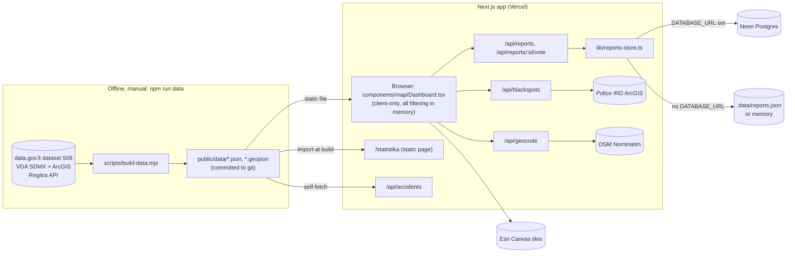
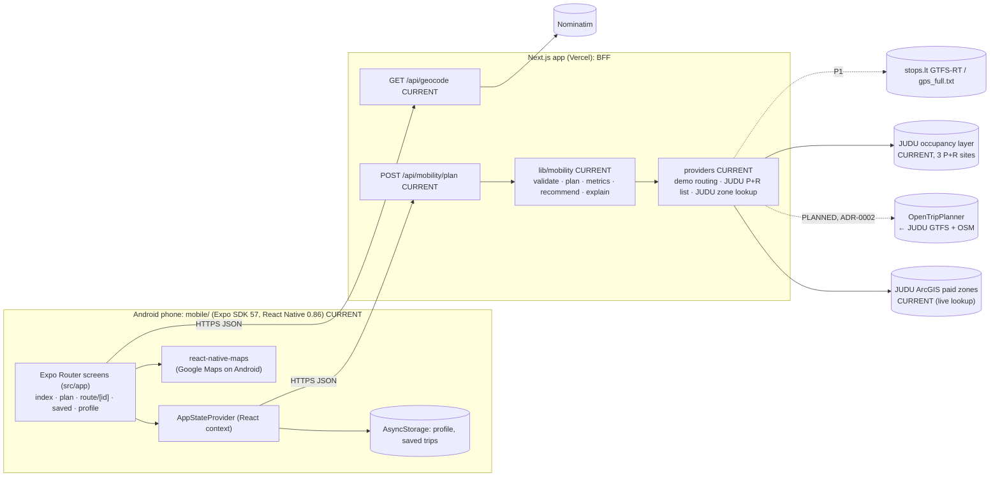

# STRUCTURE.md — how the repository works, today and in the target

> Scope: architecture, directories and responsibilities, routes and APIs, state ownership, environment variables, external systems, fragile areas.
> **Part A** describes the CURRENT legacy implementation, verified against code on `main` @ `4602fbb` (2026-10-09/10). **Part B** describes the mobile app and BFF: the v0.1-alpha exists since 2026-10-10. Each item is marked CURRENT, PARTIAL or PLANNED.
> Data details: [DATA.md](DATA.md). UI rules: [DESIGN.md](DESIGN.md). Verification: [TESTING.md](TESTING.md). Product: [PRODUCT.md](PRODUCT.md). Recommendation engine and API contract: [ROUTING.md](ROUTING.md). Roadmap: [PLAN.MD](PLAN.MD). Decisions: [ADR-0001](docs/adr/0001-pivot-to-personalized-multimodal-mobility.md) (pivot), [ADR-0002](docs/adr/0002-routing-provider-strategy.md) (routing provider), [ADR-0003](docs/adr/0003-mobile-project-isolation-and-contract-sharing.md) (mobile isolation, shared contract).

## Product status

| Product | Status | Code |
|---|---|---|
| **Personalised multimodal mobility decision app** (Android-first, Vilnius) | **PRIMARY. v0.1-alpha CURRENT** (`mobile/`, `app/api/mobility/plan`, `lib/mobility/`); route legs come from a **demo** provider (ADR-0002) | Part B |
| **Eismo Pulsas road-safety web app** (accident map, statistics, danger reports, public API) | **LEGACY. CURRENT, working, deployed; fixes only, not extended** | Part A |

Status labels used in this file: **CURRENT** (exists in code), **PARTIAL**, **PLANNED** (agreed target, not built), **PROPOSED** (suggested, not yet agreed), **POSSIBLE** (idea).

## Repository layout

```
/                         CURRENT unless marked
├─ app/                   Next.js App Router: legacy pages + all API route handlers
│  ├─ page.tsx, apie/, statistika/      legacy web pages (LEGACY)
│  └─ api/
│     ├─ accidents/, reports/, blackspots/, geocode/   CURRENT public API (contracts frozen; geocode used by mobile)
│     └─ mobility/plan/   CURRENT  BFF endpoint for the mobile app (ROUTING.md § 9)
├─ components/            legacy web UI (map/, stats/, header) (LEGACY)
├─ lib/
│  ├─ data.ts, stats.ts, reports.ts, reports-store.ts   CURRENT (legacy domain + report storage)
│  └─ mobility/           CURRENT  contract types, validation, strategies, metrics, recommendation, explanation, providers, scenarios
├─ db/schema.sql          CURRENT  reports DDL (legacy)
├─ public/data/           CURRENT  generated accident/statistics data (legacy; possible P2 reuse)
├─ scripts/build-data.mjs CURRENT  legacy data pipeline
│  └─ mobility/           PROPOSED GTFS / P+R / parking preprocessing scripts, if a provider needs them
├─ mobile/                CURRENT  Expo SDK 57 + React Native app (own package.json; NOT an npm workspace; ADR-0003)
├─ docs/adr/              CURRENT  architecture decision records
├─ docs/context/          raw input for the pivot (product brief, JUDU links) — informs PRODUCT.md / DATA.md, not canonical
├─ docs/archive/          historical description of the legacy safety product — context only
└─ *.md                   CURRENT  AGENTS, STRUCTURE, DATA, DESIGN, TESTING, PRODUCT, ROUTING, PLAN.MD, README
```

## Reuse map: legacy → new product

| Legacy asset | Reuse for mobility | Status |
|---|---|---|
| Next.js route handlers on Vercel (`app/api/*`) | Host the BFF (`app/api/mobility/*`) | CURRENT reuse |
| `GET /api/geocode` (Nominatim proxy, Lithuanian, 24 h cache, 1 req/s spacing) | Address search for origin and destination, called by the mobile app **unchanged** (submit-based) | CURRENT reuse |
| Server-side proxy pattern (User-Agent, cache, stale-on-error) from `geocode` / `blackspots` | Pattern for JUDU, Meteo.lt and routing providers | CURRENT reuse (`lib/mobility/providers/judu-parking-zones.ts`) |
| `lib/data.ts` `distance()` (haversine), `nf` (lt-LT format) | Not reused: `lib/mobility/geo.ts` and `format.ts` have their own small helpers, so mobility does not depend on legacy modules | — |
| Accident datasets (`public/data/accidents-YYYY.json`) | P2 safety scoring of walking and cycling legs | POSSIBLE |
| Neon Postgres | Not needed in v0.1 (personal data stays on the device) | Not reused in P0 |
| Leaflet dashboard, `components/*`, `/statistika`, `/apie` | **Not** reused as mobile UI | LEGACY only |
| Tailwind tokens in `app/globals.css` | Not reused (React Native has no CSS). Design principles carry over via DESIGN.md | — |

---

# PART A — CURRENT LEGACY ARCHITECTURE (Eismo Pulsas web)

## A1. Purpose

A Lithuanian-language web app. It shows official police traffic-accident records (2021–2025) on an interactive map and lets anyone mark a place they consider dangerous (and "+1" places others marked). It also presents editorial statistics derived from public datasets. Three routes: map (`/`), statistics (`/statistika`), about/API (`/apie`).

## A2. Technology stack (from `package.json`)

| Area | Package | Version |
|---|---|---|
| Framework | `next` | **16.3.8** (App Router, Turbopack). Not the Next.js in model memory: see `AGENTS.md`. |
| UI runtime | `react`, `react-dom` | 19.2.8 |
| Map | `leaflet` ^1.9.4, `react-leaflet` ^5.0.0 | |
| DB driver | `@neondatabase/serverless` ^1.1.0 | HTTP SQL tagged templates (`neon(url)`) |
| Server guard | `server-only` ^0.0.1 | used in `lib/reports-store.ts` |
| Styling | `tailwindcss` ^4 via `@tailwindcss/postcss` | CSS-first config in `app/globals.css` (`@theme inline`), no `tailwind.config.*` |
| Types/lint | `typescript` ^5, `eslint` ^9, `eslint-config-next` 16.3.8 | flat config `eslint.config.mjs` (core-web-vitals + typescript) |
| Fonts | `next/font/google`: Inter (body), Space Grotesk (display) | `app/layout.tsx` |

There is no test framework, state library, charting library, heatmap library or ORM. `next.config.ts` is empty. `tsconfig.json` has `include: ["**/*.ts", "**/*.tsx", …]` and excludes `node_modules` and `mobile` (ADR-0003), with the path alias `@/*` → `./*`. `eslint.config.mjs` ignores `mobile/**`.

## A3. High-level architecture



Key facts:

- **Official data never touches the database.** It is pre-built into static JSON under `public/data/` and committed. The map downloads one file per selected year and filters **in the browser**.
- **Postgres holds only user reports and votes.** Without `DATABASE_URL`, a JSON file store is used.
- **Black spots and geocoding are live proxies** to third-party services with small in-memory caches.
- The map page is a client-only island (`ssr: false`). The statistics and about pages are statically prerendered. `next build` output: `○ /`, `○ /apie`, `○ /statistika`; all `/api/*` are `ƒ` dynamic.

## A4. Repository architecture (by responsibility)

| Path | Responsibility | Depended on by |
|---|---|---|
| `app/layout.tsx` | `<html lang="lt">`, fonts (CSS vars `--font-inter`, `--font-grotesk`), metadata, theme colour | every page |
| `app/globals.css` | Design tokens (`--bg`, `--panel`, `--chip`, `--line`, `--ink`, `--muted`, `--accent`, `--fatal`, `--injury`, `--damage`), Leaflet overrides, all custom map-marker CSS (`.ep-*`), keyframe animations, reduced-motion rule | all UI; marker HTML strings in `layers.tsx` |
| `app/page.tsx` | `/` → `<MapLoader/>` | — |
| `components/MapLoader.tsx` | `next/dynamic(..., { ssr: false })` wrapper; loading text "Kraunamas eismo pulsas…" | `app/page.tsx` |
| `components/map/Dashboard.tsx` | **Owner of all map state**: source, filters, view, selection, report mode, timeline, camera, loaded data. Also data loading; derived data (filtered set, hotspots, heat points, choropleth values); top bar incl. `SourceSwitch`; floating buttons | `MapLoader` |
| `components/map/panels.tsx` | Sidebar content: `FiltersPanel`, `DetailPanel` (+ `StatsBlock`, `AccidentCard`), `ReportPanel`, `AddressSearch`; local primitives `Section`, `Chip`, `Segmented`, `Toggle`, `MiniBars` | `Dashboard` |
| `components/map/layers.tsx` | Leaflet layers: `PointsLayer` (canvas circle markers, imperative), `PulseLayer`, `HeatmapLayer`, `ChoroplethLayer`, `HotspotLayer`, `BlackspotLayer`, `ReportsLayer` (with vote popup), `DraftMarker`, `SelectionMarker`, `MapClick`, `CameraControl` | `Dashboard` |
| `components/map/heat-layer.ts` | Custom `L.Layer` canvas heatmap (no plugin) | `layers.tsx` |
| `components/map/Timeline.tsx` | Month histogram + play/pause scrubber | `Dashboard` |
| `components/stats/charts.tsx` | Client chart primitives (`Segmented` [second implementation], `HBars`, `Columns`, `Counter`) and sections (`MakesChart`, `MunicipalityRanking`, `AgeChart`, `HourWeekGrid`) | `app/statistika/page.tsx` |
| `app/statistika/page.tsx` | Statistics page; **imports `public/data/stats.json` at build time**; local `Card`, `Tile` | — |
| `app/apie/page.tsx` | About + hand-written API list (`ENDPOINTS` array, not generated from routes) | — |
| `components/SiteHeader.tsx`, `components/Logo.tsx` | Header for `/statistika` and `/apie` (the map has its own header inside `Dashboard`) | pages |
| `lib/data.ts` | Accident types, `YEARS`, `FLAG` bit flags, `SEVERITY` colours/labels, `CATEGORIES`, month names, year-file decoder + memoised `loadYear`, `matches()` filter, `streetKey()`, haversine `distance()`, `nf` (lt-LT number format) | map, API, store |
| `lib/stats.ts` | TypeScript shape of `stats.json`, `shortMuni()` | map, statistics |
| `lib/reports.ts` | Report categories (id/label/icon/colour), `Report` type, `MERGE_RADIUS_M = 35`; shared client/server | map, API, store |
| `lib/reports-store.ts` | `server-only` storage abstraction: Postgres store vs JSON-file store; `voterId()` header validation | report API routes |
| `db/schema.sql` | Reference DDL (the app auto-creates the same tables) | humans |
| `scripts/build-data.mjs` | Data pipeline that writes `public/data/*` | `npm run data` |
| `public/data/` | Generated data (≈6.5 MB). See [DATA.md](DATA.md) › Part B | map, API, statistics |
| `public/*.svg` | create-next-app leftovers (`file`, `globe`, `next`, `vercel`, `window`), not referenced by code | — |

## A5. Routes

| Route | Rendering | What it shows |
|---|---|---|
| `/` | Static shell; the map is client-only | Header (logo, Oficialūs/Vartotojų/Mix switch, nav), sidebar (search + filters / detail / report form), Leaflet map, floating basemap + report buttons, timeline |
| `/statistika` | Static (data baked in at build) | Hero, 4 total tiles, BMW × bus-stop counter, fun facts, makes ranking, municipality ranking, top-15 streets, age chart, weekday×hour grid, fatalities by year, sources |
| `/apie` | Static | Description, data sources, API endpoint list, limitations |
| anything else | Next.js default 404 (English, unstyled) | — |

There is **no URL state**. Filters, selection, source mode and view are not reflected in the URL, so views cannot be linked or restored on reload.

## A6. API routes (public contracts; do not change without updating `/apie`)

All handlers are Web `Request`/`Response` route handlers in `app/api/**/route.ts`. Error messages are Lithuanian JSON `{ error }`.

| Method & path | Owner file | Behaviour |
|---|---|---|
| `GET /api/accidents?year&muni&category&severity&limit` | `app/api/accidents/route.ts` | Reads `/data/accidents-YEAR.json` **by HTTP-fetching its own origin**, filters, and returns a GeoJSON `FeatureCollection` (a subset of fields). Defaults: latest year, `severity=fatal,injury`, `limit=5000` (max 20 000). 400 on an unknown year or category. `Cache-Control: public, s-maxage=86400`. Duplicates the year-file decoder from `lib/data.ts`. |
| `GET /api/reports` | `app/api/reports/route.ts` | All reports with vote counts. |
| `POST /api/reports` | same | Body `{lat,lng,category,note?}` + header `x-voter-id`. Validates the Lithuania bbox (53.85–56.5 N, 20.9–26.9 E) and the category id, trims the note to 280 chars, rounds coordinates to 6 dp. Returns `{report, merged, alreadyVoted}`; 201 new / 200 merged. |
| `POST /api/reports/:id/vote` | `app/api/reports/[id]/vote/route.ts` | One vote per `x-voter-id`; 404 if missing. Uses the Next 16 global `RouteContext<"/api/reports/[id]/vote">` type. |
| `GET /api/blackspots` | `app/api/blackspots/route.ts` | Proxies Police IRD ArcGIS layer 0 as GeoJSON. Module-level cache of 6 h; serves the stale cache on upstream failure, else 502. |
| `GET /api/geocode?q=` / `?lat&lng` | `app/api/geocode/route.ts` | Nominatim search (Lithuania only, max 8 results, town-aware re-ranking and a street-level retry) or reverse geocode. Module-level cache of 24 h (cleared above 2 000 keys). Requests are spaced ≥1 s apart **per server instance**. **Used by the mobile app unchanged** (`mobile/src/api/client.ts`). |

`/data/*.json` files are also directly downloadable and are advertised on `/apie` as part of the "open API".

## A7. Important components and boundaries

- **`Dashboard`** is the single state owner and the only place that wires data to layers and panels. Panels and layers are presentational and receive callbacks. Keep it that way: new map features should add state here (or extract a hook from here), not create a parallel store.
- **The sidebar has three mutually exclusive modes**, chosen in the `Dashboard` render: `reportMode` → `ReportPanel`; else `selection` → `DetailPanel`; else `FiltersPanel`. Opening a detail or the report form *replaces* the filters.
- **`PointsLayer` is imperative**: one `L.layerGroup` of canvas `circleMarker`s, rebuilt on every change of `accidents`/`fade`. Tens of thousands of points rule out one React component per marker, so accident dots are not keyboard-focusable.
- **Marker visuals are HTML strings + global CSS** (`.ep-hotspot`, `.ep-report`, `.ep-blackspot`, `.ep-draft`, `.ep-selected`, `.ep-pulse`). Styling changes span `layers.tsx` and `globals.css`.
- **Two parallel UI primitive sets exist**: `panels.tsx` (`Segmented` with `aria-pressed`, `Chip`, `Toggle`, `MiniBars`) and `components/stats/charts.tsx` (`Segmented` with `role="radio"`, `HBars`, `Columns`). There is no shared `components/ui/`.

## A8. State architecture

All state lives in `Dashboard.tsx` (`useState`). Nothing is global and nothing is in the URL:

| State | Default | Notes |
|---|---|---|
| `source: "official" \| "users" \| "mix"` | `"mix"` | `official` hides reports; `users` hides all official layers, the timeline and the official filters, and skips loading accident files |
| `filters: { yearFrom, yearTo, months[], muni, category, severities[] }` | latest year only, all months, all LT, `all`, `["fatal","injury"]` | `muni` is a LAU code string (e.g. `"13"` = Vilniaus m.) |
| `view: "points" \| "heat" \| "regions"`, `regionMetric: "rate" \| "total"` | `points`, `rate` | |
| `showHotspots` / `showBlackspots` | `true` / `false` | black spots are fetched lazily on first enable |
| `basemap: "dark" \| "light"` | `dark` | only swaps tiles; the UI stays dark |
| `loaded: Record<year, Accident[]>` | `{}` | plus a module-level promise cache in `lib/data.ts` |
| `stats`, `geo`, `blackspots`, `reports` | fetched on mount (black spots lazily) | |
| `selection: {kind:"accident",a} \| {kind:"place",lat,lng,street?,label?,radius?}` | `null` | |
| `reportMode`, `draft` | `false`, `null` | |
| `timeline: {month, playing} \| null` | `null` | `month` = months since Jan 2020; ticks every 900 ms |
| `camera` | `null` | `{bounds|center,zoom,nonce}` consumed by `CameraControl` |
| `sidebarOpen` | `matchMedia("(min-width:1024px)")` at mount | not updated on resize |
| `voted: Set<number>` | from `localStorage["ep-voted"]` | a UI hint only; the server enforces votes |

**Derived (memoised) chain:**
1. `loaded` → `pool` (selected years)
2. → `anySeverity` (all filters except severity)
3. → `filtered` (+ severity)
4. → `timelineVisible` (the current month + 2 trailing months while the timeline is active)
5. → `hotspots`, `heatPoints`, `PointsLayer`

Two consumers branch off this chain:
- The choropleth uses `pool` with all filters except `muni`, and **ignores the timeline**.
- `DetailPanel` statistics use `anySeverity` (**all severities**, ignoring the severity toggle and the timeline), so its counts intentionally differ from what the map shows.

## A9. Data flow (summary; details in DATA.md › Part B)

1. **Offline:** `npm run data` downloads police yearly snapshots and reference data, converts LKS-94 → WGS-84, and derives flags and aggregates. It writes `public/data/accidents-YYYY.json`, `stats.json` and `municipalities.geojson`, which are committed to git.
2. **Deploy:** the files ship as static assets; `/statistika` embeds `stats.json` at build time.
3. **Runtime map:** the browser fetches `stats.json`, `municipalities.geojson` and `/api/reports`, then `accidents-YYYY.json` for each selected year. It decodes the columnar arrays → `Accident[]`, then filters and aggregates in memory.
4. **Runtime live:** `/api/blackspots` (IRD) on toggle; `/api/geocode` on search and when an empty map spot is clicked (reverse geocode to find the street).

## A10. User report architecture

- **Create:** "⚠ Pažymėti pavojingą vietą" toggles `reportMode` (crosshair cursor, banner). The location comes from a map click, the general search box, or the form's own address search; the draft marker is draggable. A category is required (7 ids in `lib/reports.ts`); the note is optional (≤280). Submit → `POST /api/reports`.
- **Merge = vote:** the store looks for an existing report of the **same category within `MERGE_RADIUS_M` (35 m)**. If one is found, the submission becomes a vote on it (`merged: true`); otherwise a new report is created and the creator's vote is added.
- **Vote:** "+1 Aš irgi" in a report popup → `POST /api/reports/:id/vote`.
- **Voter identity:** `getVoterId()` in `Dashboard.tsx` creates `crypto.randomUUID()` and stores it in `localStorage["ep-voter"]` (falling back to an in-memory id). It is sent as `x-voter-id`; the server accepts `^[a-zA-Z0-9-]{8,64}$`. This is **one vote per browser profile, not per person**: clearing storage or scripting requests creates new voters. There is no auth, rate limiting, moderation or deletion endpoint.
- **Nearby reports:** `DetailPanel` lists reports within **250 m** of the selection (computed client-side).
- **Display:** `ReportsLayer` renders every report as a `divIcon` sized by `sqrt(votes)` (26–46 px) with a vote-count badge, in `users` and `mix` modes. After a successful submission in `official` mode the app switches to `mix`.
- **Persistence:** see [DATA.md › User-generated data](DATA.md#b4-user-generated-data-current). Postgres is used when `DATABASE_URL` is set. Otherwise reports go to `.data/reports.json` (gitignored), falling back to process memory if the filesystem is read-only (e.g. serverless); in that case reports vanish on a cold start and are not shared between instances.

## A11. Environment variables (CURRENT)

| Name | Purpose |
|---|---|
| `DATABASE_URL` | Postgres connection string (Neon). Selects the Postgres report store. Optional locally. Obtain via `npx vercel env pull .env.local`. |

That is the only variable the legacy code reads (`lib/reports-store.ts`). `.env*` files are gitignored. Never print or commit values. The mobility variables (`MOBILITY_ROUTING_PROVIDER`, `EXPO_PUBLIC_API_BASE_URL`, …) are listed in B7.

## A12. External systems (verified in code)

| System | Used for | Where | Failure behaviour |
|---|---|---|---|
| Vercel | Hosting, preview deployments, env vars (README workflow; `.vercel` gitignored, no `vercel.json`) | — | — |
| Neon Postgres | Reports + votes | `lib/reports-store.ts` | the API returns 500 with a Lithuanian error |
| Esri ArcGIS Online "Canvas" World Dark/Light Gray Base + Reference tiles | Basemap | `Dashboard.tsx` `TileLayer` (keyless, `maxNativeZoom 16`) | blank map background |
| OSM Nominatim | Search + reverse geocode | `app/api/geocode/route.ts` | 502 → inline error under the search box |
| Police IRD ArcGIS (`maps.ird.lt` EIIS MapServer/0) | Official black spots | `app/api/blackspots/route.ts` | stale cache, or 502 → red text in the filters panel |
| data.gov.lt, VDA SDMX/ArcGIS, Regitra `get.data.gov.lt` | Build time only | `scripts/build-data.mjs` | the script exits 1 |

`/apie` credits "OpenStreetMap ir CARTO" for the basemap, but the code uses Esri tiles (the map attribution and README say Esri). The about-page text is out of date.

## A13. Where to implement legacy work (fixes only; see AGENTS.md)

- **Map filter:** add it to `Filters` + `matches()` in `lib/data.ts`, the UI in `FiltersPanel`, and the default in `Dashboard` state. If it needs a new per-accident attribute, the attribute must be produced by `scripts/build-data.mjs` (new flag bit or column) **and** decoded in `lib/data.ts` **and** (if public) in `app/api/accidents/route.ts`.
- **Participant category:** a new `FLAG` bit in both `lib/data.ts` and `scripts/build-data.mjs` (`F`), an entry in `CATEGORIES`, then rebuild the data.
- **Map layer:** a component in `layers.tsx`, state and a render condition in `Dashboard`, a toggle in `FiltersPanel`, marker CSS in `globals.css`. Read DESIGN.md › Part C first.
- **Statistic:** compute it in `scripts/build-data.mjs` → extend `Stats` in `lib/stats.ts` → render it in `app/statistika/page.tsx` using the `components/stats/charts.tsx` primitives. `/statistika` needs a rebuild to show a new `stats.json`.
- **Report behaviour** (merge radius, categories, validation): `lib/reports.ts` (shared), `lib/reports-store.ts` (both stores!), `app/api/reports/route.ts`. Keep `db/schema.sql` in sync with the auto-create SQL.
- **New year of data:** see DATA.md › B16 (several hard-coded "2021–2025" strings must change).

## A14. Fragile / high-risk areas (legacy)

1. **Flag bits are duplicated** (`lib/data.ts` `FLAG` ↔ `scripts/build-data.mjs` `F`) and baked into committed data. Never renumber existing bits; only append.
2. **Year-file format** (`YearFile` columnar layout, ×1e5 coordinates, minutes-since-2020 epoch) is decoded in **two** places (`lib/data.ts`, `app/api/accidents/route.ts`). Change all three (the script + the two decoders) together.
3. **`YEARS` / `OFFICIAL` / hard-coded year strings**: see DATA.md. `AgeChart` divides by a literal `5` (years).
4. **`npm run data -- <year>` rewrites `stats.json` from only the given years.** It sets `stats.years = wanted` and accumulates every aggregate only over `wanted`, silently dropping the other years from every statistic, even though README presents it as "tik vieni metai". Only run a partial build if you understand this.
5. **`scripts/build-data.mjs` root path on Windows:** `path.resolve(path.dirname(new URL(import.meta.url).pathname), "..")` evaluates to `C:\C:\…` on Windows. This was verified by evaluating the expression; the script itself was not run. Expect the data build to fail or write to the wrong path on Windows. Run it under WSL/macOS/Linux, or fix it with `fileURLToPath` in a dedicated task.
6. **The two report stores must stay behaviourally identical** (merge rule, vote semantics). The file store is not safe for multi-instance production.
7. **`/api/accidents` fetches its own origin.** This breaks if the deployment is behind auth or protection, or if the origin is unreachable from the server (unverified on a Vercel Preview with protection enabled).
8. **HTML injected into Leaflet** via `bindTooltip` strings and `dangerouslySetInnerHTML` in `BlackspotLayer` uses upstream IRD properties unescaped. Treat any change here as security-sensitive; escape anything you add.
9. **In-memory caches and rate limiting** (`geocode`, `blackspots`) are per serverless instance, so Nominatim's 1 req/s policy is not guaranteed globally. This matters more once a mobile app also calls `/api/geocode`.
10. **The initial `sidebarOpen` value reads `window.matchMedia`.** This is safe only because the dashboard is `ssr: false`. Do not move `Dashboard` to SSR without addressing this and the `localStorage` access.
11. **The `AGENTS.md` Next.js block** is managed by `next dev` (markers `BEGIN/END:nextjs-agent-rules`). Edit only outside the markers.

## A15. Generated files: do not hand-edit

| File | Generated by | Edit policy |
|---|---|---|
| `public/data/accidents-2021…2025.json` | `npm run data` | Never by hand. Regenerate. |
| `public/data/stats.json` | `npm run data` (all years) | Never by hand. Rebuild the app afterwards (statistika imports it). |
| `public/data/municipalities.geojson` | `npm run data` | Never by hand. |
| `.cache/ei_YYYY.json` | `npm run data` download cache (gitignored, ~100 MB/yr) | Delete to force a re-download. |
| `.data/reports.json` | file report store at runtime (gitignored) | Local dev data only. |
| `.next/`, `next-env.d.ts`, `*.tsbuildinfo` | Next.js / TS (gitignored) | Never commit. |
| `package-lock.json` | npm | Change only through npm. |

---

# PART B — MOBILE APP AND BFF (v0.1-alpha)

> **Status (2026-10-10): v0.1-alpha CURRENT.** The end-to-end slice exists. Its verification so far is listed in TESTING.md › B0: type-check, lint, expo-doctor, an Android bundle export, static rendering of every route, and curl/integration checks against the BFF. It has **not** yet run on a physical Android phone. Route legs are **demo** data (ADR-0002).

## B1. Architecture



Principles:
- **Thin client, smart BFF.** The app collects input, calls the BFF, renders the result and stores personal data locally. Strategies, metrics, recommendation and explanation run in `lib/mobility` (ROUTING.md).
- **The app never calls third parties directly**, apart from the map SDK's tiles. It knows nothing about OTP, GTFS, ArcGIS or providers.
- **Personal data stays on the device** (ADR-0001). The BFF is stateless per request and does not log request bodies.
- **Provenance is part of the contract:** `basis`, `dataMode`, `sources`, `assumptions`. Demo data cannot pass as real.

## B2. Mobile app (`mobile/`, CURRENT)

Expo SDK 57 (React Native 0.86, React 19.2, TypeScript 6), Expo Router (typed routes, React Compiler enabled by the template), `react-native-maps` 1.27, `@react-native-async-storage/async-storage`, `@react-native-community/datetimepicker`. Packages are added with `npx expo install`.

The app has its own `package.json`, `package-lock.json`, `tsconfig.json` (path alias `@/*` → `src/*`), `eslint.config.js` and `.gitignore`. It is **not** an npm workspace (ADR-0003).

| Path | Responsibility |
|---|---|
| `mobile/app.json` | Name "Eismo Pulsas", Android package `lt.eismopulsas.app`, scheme, plugins (expo-router, splash, datetimepicker) |
| `mobile/src/app/_layout.tsx` | Root `Stack` (no tab bar), Home deep-link anchor, measured wrapping `ScreenHeader`, theme from tokens, `AppStateProvider` |
| `mobile/src/app/index.tsx` | **Home**: Iš / Į (address search), Atvykti iki (Šiandien/Rytoj + native time picker), optional stay, profile line, "Palyginti", saved trips |
| `mobile/src/app/plan.tsx` | **Comparison**: context line, preference selector (sends a new request), recommendation + sentence, alternatives, unavailable strategies, "Kodėl?" (assumptions + sources), demo-data note, "Išsaugoti" |
| `mobile/src/app/route/[id].tsx` | **Route detail**: time, departure/arrival, cost/CO₂, reason, map, leg timeline, cost breakdown |
| `mobile/src/app/saved.tsx` | **Saved trips**: open (one tap), delete with undo |
| `mobile/src/app/profile.tsx` | **Profile**: car yes/no, fuel, consumption, PT pass, max walking, priority |
| `mobile/src/api/contract.ts` | Type-only re-export of `lib/mobility/types.ts` (the canonical contract) |
| `mobile/src/api/client.ts`, `validate-response.ts` | BFF client (`fetchPlan`, `geocode`), validated HTTP(S) origin from `EXPO_PUBLIC_API_BASE_URL`, 15 s deadline through body decoding, cancellation, checks of fields consumed by the UI, Lithuanian errors |
| `mobile/src/state/app-state.tsx` | Profile, saved trips, trip draft; hydration gate, one active plan, cancellation on leaving comparison, exact-request retry, stale responses ignored, synchronous save guard |
| `mobile/src/state/storage.ts` | AsyncStorage persistence (`eismopulsas.profile.v1`, `eismopulsas.savedTrips.v1`); validates loaded values and serialises writes per key |
| `mobile/src/domain/trip.ts`, `labels.ts` | Trip draft, saved trip, request building, default profile; Lithuanian labels |
| `mobile/src/format/lt.ts` | lt-LT numbers, €, kg, durations, clock, ISO with offset, plural, decimal-comma parsing |
| `mobile/src/ui/*` | One primitive per component: `tokens`, `text`, `button`, `segmented`, `inline-message`, `place-field`, `option-row` (+ leg strip), `saved-trip-row`, `route-map` (+ `.web` placeholder), `screen` (keyboard avoidance, safe side/bottom insets), `screen-header` (safe top inset) |

**State ownership:**
- The profile and saved trips belong to `AppStateProvider`; they are loaded from storage at start and written on change.
- The current draft and plan live in memory.
- Route params carry ids (`/route/[id]`); screens read objects from the context.
- There is no global state library.

## B3. BFF (`app/api/mobility/*`, `lib/mobility/*`, CURRENT)

| Path | Responsibility |
|---|---|
| `app/api/mobility/plan/route.ts` | Parse JSON, validate, call `planTrip` with `getProviders()`, `{ error, code }` errors, `no-store` |
| `lib/mobility/types.ts` | **Canonical contract** (types only, no imports; the mobile app imports it type-only) |
| `lib/mobility/validate.ts` | Request validation, service area, default profile |
| `lib/mobility/plan.ts` | Orchestration: strategies in parallel, P+R composition, lateness, provenance, assumptions |
| `lib/mobility/metrics.ts` | Energy cost/CO₂, zone parking cost, fares, `weakest()` basis |
| `lib/mobility/recommend.ts` | Feasibility pool, dominance, preference rules (pure) |
| `lib/mobility/explain.ts` | Lithuanian explanations from metric differences (pure) |
| `lib/mobility/format.ts`, `geo.ts` | lt-LT formatting, plural; haversine, Vilnius time, hash |
| `lib/mobility/config.ts` | Constants with source and status (DATA.md › A6) |
| `lib/mobility/providers/` | `types.ts` (interfaces), `demo.ts` (**DEMO**), `judu-park-ride.ts`, `judu-parking-zones.ts` (`server-only`), `judu-parking-occupancy.ts` (`server-only` fetch), `judu-parking-occupancy-data.ts` (pure parser + injected-loader cache), `index.ts` (selection, `server-only`) |
| `lib/mobility/scenarios/` | Demo/regression request bodies (TESTING.md › B2–B3) |

`server-only` is imported by the modules that do I/O or read env (`providers/index.ts`, `providers/judu-parking-zones.ts`). The pure modules stay importable from plain Node scripts.

`PlanDeps.parkingAvailability` is an optional `ParkingAvailabilityProvider`, registered in `getProviders()`. One snapshot enriches the selected P+R site by canonical id. The service uses a 2,5 s timeout, coalesces concurrent fetches and caches for 30 s per instance; it validates observation age on cache hits. Stale (>2 min), invalid, missing or failed data gives `availability: null` with a warning. It preserves live provenance and timestamps while keeping routes, metrics and demo labels unchanged. Omitting the enricher preserves deterministic offline tests. `scripts/check-judu-occupancy.mjs` exercises this path (TESTING.md B4a).

## B4. Mobile ↔ BFF communication

- Base URL: `EXPO_PUBLIC_API_BASE_URL` (embedded in the app at build time; public, so never put secrets in it):
  - Android **emulator** → `http://10.0.2.2:3000`;
  - **physical phone** → `http://<dev machine LAN IP>:3000`, on the same Wi-Fi, with the Windows firewall allowing port 3000. `next dev` listens on all interfaces and prints the "Network" URL;
  - **Vercel Preview / production** → `https://<deployment>.vercel.app`. Preview deployments with Vercel Authentication enabled are not reachable from the app: use production or disable protection for the Preview.
- Missing or malformed base URL → an inline setup error on Home before planning. It must be an HTTP(S) **origin** (no credentials, path, query or fragment). Native builds reject `localhost`, `127.x.x.x`, `0.0.0.0` and `[::1]`; use the emulator/LAN/deployment address above. Fix `EXPO_PUBLIC_API_BASE_URL`, restart Expo and fully reload the app; installed bundles need rebuilding.
- Plain `http://` to a LAN address is normally fine in Expo Go during development (not verified on a device here). A release APK should use HTTPS (the Vercel URL), because Android blocks cleartext traffic by default.
- React Native `fetch` is not subject to CORS. The BFF sends no CORS headers; a web build of the app would need them (not planned).
- Timeouts: 15 s on the client including body decoding; 2,5 s each for zone lookup and occupancy on the server (in parallel). Leaving a loading comparison aborts the client request; retry sends its stored request unchanged. Address edits/clear/unmount cancel search and discard stale results. No automatic network retry.
- Versioning: the response carries `version: 1`. Contract changes go through ROUTING.md § 9 + `lib/mobility/types.ts` in one PR; the app's type-check catches drift.

## B5. Root tooling isolation (CURRENT, ADR-0003)

| Collision | Fix in place | Verified |
|---|---|---|
| Root `tsconfig.json` would type-check `mobile/**` | `exclude: ["node_modules", "mobile"]` | root `npm run build` passes |
| Root ESLint would lint `mobile/**` | `globalIgnores([... "mobile/**"])` | root `npm run lint` passes; ESLint run inside `mobile/` without its own config reports every file as ignored |
| Root `.gitignore` anchors `/node_modules` | `mobile/.gitignore` (Expo template) + root safety net `/mobile/node_modules/`, `/mobile/.expo/` | `git status` shows no `mobile/node_modules` |
| Two lockfiles: possible Turbopack root warning | none needed | no warning in `next build` |
| Vercel uploads `mobile/` | none (not built by Next) | — |

## B6. External systems

| System | Purpose | Status |
|---|---|---|
| Routing provider | legs and durations | **DEMO** today; OpenTripPlanner next (ADR-0002) |
| JUDU ArcGIS paid-zone layer | parking cost at the destination | CURRENT (live point lookup) |
| JUDU P+R page | P+R sites and ticket | CURRENT (static, in code) |
| JUDU occupancy layer | current free spaces at the three P+R sites | CURRENT, optional enricher; other gated lots remain P1 |
| JUDU GTFS, stops.lt GTFS-RT, `gps_full.txt` | timetable / live delays via OTP | VERIFIED AVAILABLE / RESEARCHED, not integrated |
| Meteo.lt | weather (P1) | VERIFIED AVAILABLE, not integrated |
| OSM Nominatim via `/api/geocode` | address search | CURRENT |
| Google Maps SDK for Android (`react-native-maps`) | map | CURRENT in Expo Go (no key needed). A **standalone/dev build needs a Google Maps Android API key**, set through the `react-native-maps` config plugin (`androidGoogleMapsApiKey`, from an env var in an `app.config` file, never committed) and restricted to package `lt.eismopulsas.app` + signing SHA-1 |
| Expo / EAS Build, or a local Android build | installable APK | PLANNED |

## B7. Environment variables (names only, never values)

| Name | Where | Purpose | Status |
|---|---|---|---|
| `EXPO_PUBLIC_API_BASE_URL` | `mobile/.env` (gitignored; template `mobile/.env.example`) or the shell when starting Expo | BFF base URL. Public by design | CURRENT |
| `MOBILITY_ROUTING_PROVIDER` | server env (Vercel / `.env.local`) | Routing provider: `demo` (default, the only one today). Unknown values fail loudly | CURRENT |
| `OTP_BASE_URL` | server env | OpenTripPlanner endpoint | PLANNED (ADR-0002) |
| Google Maps Android API key | mobile build env, read by an `app.config` file | Map in standalone builds | PLANNED; exact name set when the config is added |

Rule: anything prefixed `EXPO_PUBLIC_` is public. Server secrets never go into the mobile app.

## B8. Development workflow

```
git switch main && git pull --ff-only origin main
git switch -c feature/<area>-<short-task>          # area: mobile | bff | legacy | data | docs
# BFF:    npm run dev  (root)  → curl POST /api/mobility/plan with lib/mobility/scenarios/*.json
# Mobile: cd mobile && npm install
#         set EXPO_PUBLIC_API_BASE_URL (mobile/.env, see .env.example), then: npx expo start
#         open in Expo Go on an Android phone (QR code) or press "a" for an emulator
# checks: root npm run lint && npm run build; mobile: npx tsc --noEmit && npm run lint && npx expo-doctor
```

Merge-conflict hotspots: `lib/mobility/types.ts` (contract), `lib/mobility/config.ts`, `lib/mobility/plan.ts`, `mobile/src/app/plan.tsx`, `mobile/src/state/app-state.tsx`.

## B9. Where to implement mobility work

| Task | Place |
|---|---|
| Real routing provider (OTP) | new `lib/mobility/providers/otp.ts` implementing `RoutingProvider`; register in `providers/index.ts`; ADR-0002 migration path |
| Live enricher (P+R occupancy, delays, weather) | `lib/mobility/providers/*`, called from `plan.ts` with a time budget; fill existing contract fields (`parking.availability`); DATA.md › A2 status |
| New strategy (walk, bike, park and walk) | `plan.ts` + metrics + `explain.ts` phrases + `Strategy` type; ROUTING.md § 2 |
| Constant (fare, tariff, factor) | `lib/mobility/config.ts` with source and status + DATA.md › A6 |
| Contract change | ROUTING.md § 9 + `lib/mobility/types.ts` (the app picks it up through the type-only import) |
| Screen / component | `mobile/src/app/*`, `mobile/src/ui/*`, following DESIGN.md › Part B |
| On-device data | `mobile/src/state/*`, `mobile/src/domain/trip.ts`; ROUTING.md § 10 |

## B10. Fragile / high-risk areas

1. **Demo data honesty:** `providers/demo.ts` is synthetic. Keep `basis: "demo"`, `dataMode`, the app's demo note, and the "no line numbers" rule. Never tune it to make an option win.
2. **The contract file must stay types-only with no imports** (ADR-0003); otherwise mobile lint/Metro break.
3. **Routing provider dependency:** quotas, hosting (OTP outside Vercel), latency. Keep `demo` as the fallback provider for the demo.
4. **Time handling:** arrive-by with offsets; server-side Vilnius local time (`geo.ts › vilniusParts`); the GTFS service day (times > 24:00) when OTP lands; DST.
5. **Per-instance caches on Vercel** (zone lookup, geocode), as in A14 #9.
6. **ArcGIS layer changes:** the zone lookup depends on the field `Zona` and the zone names in `config.ts › PARKING_ZONES`. An unknown zone name yields a `null` cost and a stated reason.
   Occupancy matches only the three official `pavadinimas` values (Unicode/case/whitespace normalized). Name/schema changes, inconsistent counts and old timestamps give unknown, never fabricated counts. Current vacancy is not a forecast or reservation.
7. **Google Maps key in the APK:** it must be restricted; never reuse a server key.
8. **Unverified constants:** CO₂ factors are UK proxies and energy prices are assumptions (DATA.md › A6). They are always shown with "~".
